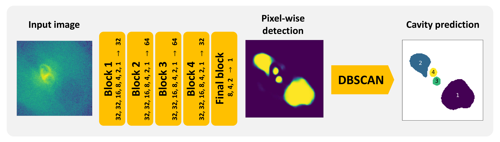

# *Cavity Detection Tool* (CADET)

[***CADET***](https://tomasplsek.github.io/CADET/) is a machine learning pipeline trained for identification of surface brightness depressions (so-called *X-ray cavities*) on noisy *Chandra* images of early-type galaxies and galaxy clusters. The pipeline consists of a convolutional neural network trained for producing pixel-wise cavity predictions and a DBSCAN clustering algorithm, which decomposes the predictions into individual cavities.

<!-- The pipeline was developed in order to improve the automation and accuracy of X-ray cavity detection and size-estimation.  -->
The architecture of the convolutional network consists of 5 convolutional blocks, each resembling an Inception layer, it was implemented using *Keras* library and it's development was inspired by [Fort et al. 2017](https://ui.adsabs.harvard.edu/abs/2017arXiv171200523F/abstract) and [Secká 2019](https://is.muni.cz/th/rnxoz/?lang=en;fakulta=1411). For the clustering, we utilized is the *Scikit-learn* implementation of the Density-Based Spatial Clustering of Applications with Noise (DBSCAN, [Ester et al. 1996](https://citeseerx.ist.psu.edu/viewdoc/summary?doi=10.1.1.121.9220)).



## Requirements

For simple usage of the ***CADET***  pipeline, following libraries are required:\
`matplotlib`\
`astropy`\
`numpy`\
`scipy`\
`sklearn`\
`keras`\
`tensorflow`

If you want to re-train the network from scratch or generate training images, an additional library is required:\
[`jax`](https://github.com/google/jax)

## Usage

The ***CADET*** pipeline inputs either raw *Chandra* images in units of counts (numbers of captured photons) or exposure-corrected images. When using exposure-corrected images, images should be normalized by the lowest pixel value so all pixels are higher than or equal to 1. For images with many point sources, they should be filled with surrounding background level using Poisson statistics ([dmfilth](https://cxc.cfa.harvard.edu/ciao/ahelp/dmfilth.html) within [CIAO](https://cxc.harvard.edu/ciao/)).

Convolutional part of the ***CADET*** pipeline can only input 128x128 images. As a part of the pipeline, input images are therefore being cropped to a size specified by parameter scale (size = scale * 128 pixels) and re-binned to 128x128 images. By default, images are probed on 4 different scales (1,2,3,4). The size of the image inputted into the pipeline therefore needs to at least 512x512 pixels (minimal input size differs if non-default scales are used) and images should be centred at the centre of the galaxy. The re-binning is performed using *Astropy* and *Numpy* libraries and can only handle integer binsizes. For floating point number binning, we recommend using [dmregrid](https://cxc.cfa.harvard.edu/ciao/ahelp/dmregrid.html) and applying ***CADET*** model manually (see Convolutional part).

Before being decomposed by the DBSCAN algorithm, pixel-wise predictions produced by the convolutional part of the ***CADET*** pipeline need to be further thresholded. In order to simultaneously calibrate the volume error and false positive rate, we introduced two discrimination thresholds (for more info see [Plšek et al. 2023]()) and their default values are 0.4 and 0.6, respectively. Nevertheless, both discrimination thresholds are changeable and can be set to an arbitrary value between 0 and 1.

The ***CADET*** pipeline is composed as a self-standing Python script (`CADET.py`), which can be run by simply calling it from a terminal using following arguments:\
`filename` - string, name of the fits file\
`scales` - list, list of size scales used to crop input images, optional (default: [1,2,3,4])\
`threshold1` - float, between 0 and 1, calibrates volume error, optional (default: 0.4)\
`threshold2` - float, between 0 and 1, calibrates false positive rate, optional (default: 0.6)

```console
$ python3 CADET.py filename [scales] [threshold1] [threshold2]
```

Example:

```console
$ python3 CADET.py NGC5813.fits
$ python3 CADET.py NGC5813.fits [1,2,3,4]
$ python3 CADET.py NGC5813.fits [1,2,3,4] 0.5 0.9
```

The `CADET.py` script loads a FITS file specified by the `filename` argument, which is located in the same folder as the main `CADET.py` script. The script creates a folder of the same name as the FITS file, and saves corresponding pixel-wise as well as decomposed cavity predictions into the FITS format while also properly preserving the WCS coordinates. On the output, there is also a PNG file showing decomposed predictions for individual scales.

The volumes of X-ray cavities are calculated under the assumption of rotational symmetry along the direction from the galactic centre towards the centre of the cavity (estimated as *center of mass*). The cavity depth in each point along that direction is then assumed to be equal to its width. Thereby produced 3D cavity models are stored in the `.npy` format and can be used for further caclulation (e.g. cavity energy estimationš)


### Convolutional part

<!-- [](https://colab.research.google.com/github/tomasplsek/CADET/blob/main/CADET_example_colab.ipynb) -->

The convolutional part of the pipeline can be used separately to produce raw pixel-wise predictions. Since the convolutional network was implemented using the functional *Keras* API, the architecture together with trained weights could have been stored in the HDF5 format (*CADET.hdf5*). Trained model can be therefore simply loaded using the `load_model` *Keras* function:

```python
from keras.models import load_model

model = load_model("CADET.hdf5")

y_pred = model.predict(X)
```

The CNN network inputs 128x128 images, however, to maintain the compatibility with *Keras*, the input needs to be reshaped as `X.reshape(1, 128, 128, 1)` for single image or as `X.reshape(-1, 128, 128, 1)` for multiple images.

Thus produced pixel-wise prediction needs to be further thresholded and decomposed into individual cavities using a DBSCAN clustering algorithm:

```python
import numpy as np
from sklearn.cluster import DBSCAN

y_pred = np.where(y_pred > threshold, 1, 0)

x, y = y_pred.nonzero()
data = np.array([x,y]).reshape(2, -1)

clusters = DBSCAN(eps=1.5, min_samples=3).fit(data.T).labels_
```

## How to cite (!!!NOT-PUBLISHED YET!!!)

The ***CADET*** pipeline was originally developed as a part of my [diploma thesis](https://is.muni.cz/th/x68od/?lang=en) and was further described in [Plšek et al. 2023](https://arxiv.org/abs/2304.05457). If you use the ***CADET***  pipeline in your research, please cite the following paper:

```
@misc{plšek2023cavity,
      title={CAvity DEtection Tool (CADET): Pipeline for automatic detection of X-ray cavities in hot galactic and cluster atmospheres}, 
      author={Tomáš Plšek and Norbert Werner and Martin Topinka and Aurora Simionescu},
      year={2023},
      eprint={2304.05457},
      archivePrefix={arXiv},
      primaryClass={astro-ph.HE}
}
```

## Todo

The following improvements for the data generation and training process are currently planned:

- [ ] add other features (cold fronts, complex sloshing, point sources, jets)
- [ ] use more complex cavity shapes (e.g. [Guo et al. 2015](https://arxiv.org/abs/1408.5018))
- [ ] train on multiband images simulated using PyXsim/SOXS
- [ ] replace DBSCAN by using instance segmentation 
- [ ] restrict the cavity number and shape using regularization?
- [ ] systematic cavity size uncertainty estimation using MC Dropout
